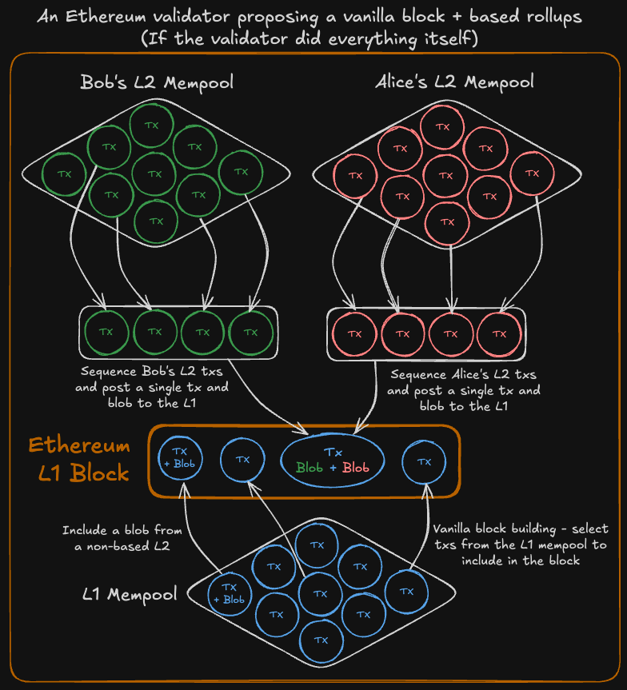

# 🔢 An introduction to sequencing

An Ethereum validator secures Ethereum. It performs several duties but for Based Rollups only the `block proposal` duty will be discussed. Block proposals are random and rare, on average once every [\~6 months](https://luckystaker.com/) but they provide the majority of the rewards a validator receives.

## Ethereum is a sequencer

Even though `Based Sequencing` has only [more recently been discussed](https://ethresear.ch/t/based-rollups-superpowers-from-l1-sequencing/15016) in the context of L2s, the Ethereum L1 has always been a sequencer.

<figure><figcaption></figcaption></figure>

When a validator is selected to propose a block they have sole and complete control over the order of the transactions in the block they build. They can't include invalid transactions (tx) but can include (or exclude) any tx as long as it covers the [base gas fee](https://ethereum.org/en/developers/docs/gas/#base-fee).


This may change in the future with features such as [FOCIL](https://eips.ethereum.org/EIPS/eip-7805) and [BRAID](https://www.coinlive.com/news/ethereum-s-road-to-anti-censorship-braid-and-focil-who-is-better) but as of writing, Ethereum validators still have absolute control during their block proposal.


When a validator only uses their local mempool to look for txs to include in their block it is called `vanilla block building`.

<figure><figcaption></figcaption></figure>

And that's it. A validator can be a full participant in the Ethereum network just by performing its required duties (attestations, etc.) and proposing vanilla blocks. So why are only \~7.5% of blocks vanilla?

<figure><figcaption>
2024-11-25  <a href="https://mevboost.pics/">https://mevboost.pics</a>
</figcaption></figure>

## MEV Boost

Maximal extractable value (MEV) is a [huge topic](https://docs.flashbots.net/new-to-mev) but from the perspective of an Ethereum validator, it's simple:

> **Someone will pay for control over the exact order of transactions within the blocks you propose.**

<figure><figcaption></figcaption></figure>

Why does the specific ordering matter? Ethereum already has a way to get transactions included in a priority order. The `priority fee` can be set higher so that validators have an incentive to include a particular tx first in a block. But there are cases where even greater control over the tx ordering can yield much higher rewards. This could be simple arbitrage between a centralized exchange and a DEX or a more malicious [sandwich attack](https://www.coingecko.com/learn/sandwich-attacks-prevention-crypto), but if there's money to be made (and there's [a lot of money](https://dune.com/defi_wonderland/mev-bots) to be made!) then someone will pay for it.

This is where [MEV Boost](https://docs.flashbots.net/flashbots-mev-boost/introduction) comes in. Finding the optimal tx order to maximize MEV is a highly sophisticated and resource-intensive activity. To allow any validator, even solo home stakers to participate in this highly competitive endeavor, a block-building marketplace was created. All a validator has to do is run the MEV Boost client and tell it which relays it wants to use. From the perspective of a validator, this is a win-win. They can opt-in and opt-out at any time, it's free to use, and they get paid significantly more for each block proposal! There's even an option to set a `min-bid` parameter so that if you as a validator get a low offer for your proposal from the MEV Boost builders, you can still build your own blocks locally.

<figure><figcaption></figcaption></figure>

| MEV Boost - Pros                                                                                                                                   | MEV Boost - Cons                                                                                                                                                                                                   |
| -------------------------------------------------------------------------------------------------------------------------------------------------- | ------------------------------------------------------------------------------------------------------------------------------------------------------------------------------------------------------------------ |
| <ul><li>Free to use</li><li>Opt-in and opt-out at any time</li><li>Set <code>min-bid</code> value as a fallback for local block building</li></ul> | <ul><li>Centralizing effect due to hyper-specialized block builders</li><li>Can decrease censorship resistance of Ethereum (<a href="https://eips.ethereum.org/EIPS/eip-7805">FOCIL</a> helps with this)</li></ul> |

When a validator uses MEV Boost it must `blind sign` the block header without seeing what will eventually be included in the block. This can be risky. If the block builder submits an invalid block or doesn't even send the full block, the validator will miss their proposal. Relays are used as the mediators for multiple block builders, and can check that blocks are valid and give validators a trusted point to query the current highest bid for their proposal slot.

<figure><figcaption></figcaption></figure>

Notice that multiple block builders can talk to multiple relays and that a single MEV Boost client being run by a validator can select which relays it connects to. There is an auction for each block with block builders submitting their highest bid and the relays sharing those bids with the validtor. The bids increase in value throughout a 12-second slot, so there is an incentive for the validator to wait as late as possible before accepting a bid to maximize their profit. But if they wait too long, they might miss the slot completely!&#x20;


These timing games are important to know about in the context of Based Rollups and preconfirmations as they add another level of economic incentive and penalty for missing a block proposal.


## Sequencing all the way up

Ethereum is a sequencer for its own transactions. A validator can choose to order the txs in their block proposals themselves or outsource it to specialized block builders through MEV Boost to significantly increase their rewards.

But what if you extend this sequencing concept further? What if instead of sequencing only the Ethereum L1 txs, Ethereum validators also sequenced L2 txs? This is `Based Sequencing` and is the foundation of `Based Rollups`.

<figure><figcaption></figcaption></figure>

As an Ethereum validator, this means 💰 **more revenue** 💰 as those L2s will pay you to sequence their txs in your slot. While the details of exactly how this will work are still being finalized the outcome for a validator should be as simple as connecting to a single entity called a `Gateway` which will act like a relay but also bundle L2 txs and preconfirmations.

<figure><figcaption></figcaption></figure>

This is how Ethereum scales. This is how Ethereum solves fragmentation and composibility. This is how Ethereum becomes the base layer for _everything_.

Many, many other benefits (synchronous atomic composability, preconfirmations, etc.) will be covered in detail in the following pages, but for now... Stay Based.
